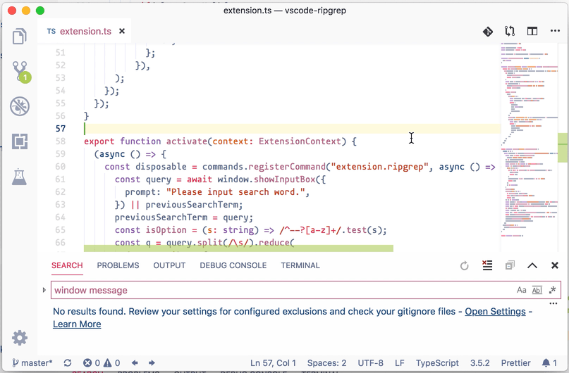

# vscode-ripgrep-fuzzy

This is a fork from [bokuweb/vscode-ripgrep](https://github.com/bokuweb/vscode-ripgrep), with these features added:

- Replace space with a non-greedy matching regex
- Repeat last search if entering empty input

See how the built-in search failed with `window message` term, and how the new search win.

Why non-greedy matching regex? Because I'm lazy, instead of keep typing `.*` or `.*?` manually in my search, I'd rather type a space ` ` and have it translate directly to what it should.